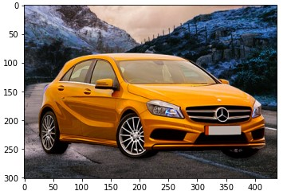
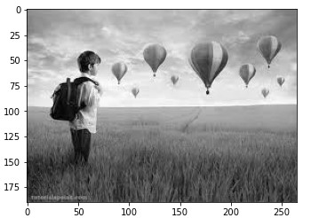
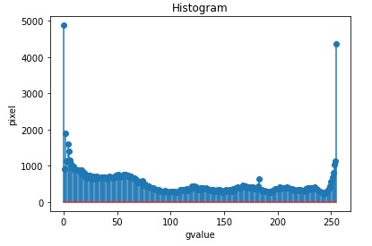
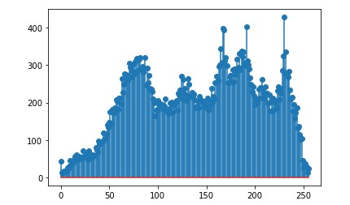
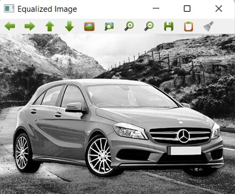

# Histogram and Histogram Equalization of an image
# AIM:
To obtain a histogram for finding the frequency of pixels in an Image with pixel values ranging from 0 to 255. Also write the code using OpenCV to perform histogram equalization.

# SOFTWARE REQUIRED:
Anaconda - Python 3.7

# ALGORITHM:
## STEP 1:
Import all the necessary libraries.

## STEP 2:
Read the images using imread() function.

## STEP 3:
Using calcHist() we can find the histogram of the images.

## STEP 4:
Using equalizeHist() we can equalize the image.

## STEP 5:
Using matplotlib.pyplot plot the histogram.

# PROGRAM:

### Developed By: R.SOMEASVAR

### Register Number: 212221230103
~~~
import cv2
import matplotlib.pyplot as plt
~~~

## Write your code to find the histogram of gray scale image and color image channels. Display the histogram of gray scale image and any one channel histogram from color image:
~~~
import cv2
import matplotlib.pyplot as plt
image=cv2.imread("2.jpg")
color=cv2.imread("3.jfif")
hist=cv2.calcHist([image],[0],None,[256],[0,256])
hist1=cv2.calcHist([color],[1],None,[256],[0,256])
plt.imshow(image)
plt.show()
plt.imshow(color)
plt.show()
plt.figure()
plt.title("Histogram")
plt.xlabel("gvalue")
plt.ylabel("pixel")
plt.stem(hist)
plt.show()
plt.stem(hist1)
plt.show()

~~~
## Write the code to perform histogram equalization of the image:
~~~
import cv2
gray_image = cv2.imread("images.jpg",0)
cv2.imshow('grey scale image',gray_image)
equ = cv2.equalizeHist(gray_image)
cv2.imshow("Equalized Image",equ)
cv2.waitKey(0)
cv2.destroyAllWindows()
~~~

# OUTPUT:
## Input Grayscale Image and Color Image:

## Histogram of Grayscale Image and any channel of Color: 

## Histogram Equalization of Grayscale Image:

# RESULT: 
Thus the histogram for finding the frequency of pixels in an image with pixel values ranging from 0 to 255 is obtained. Also,histogram equalization is done for the gray scale image using OpenCV.
